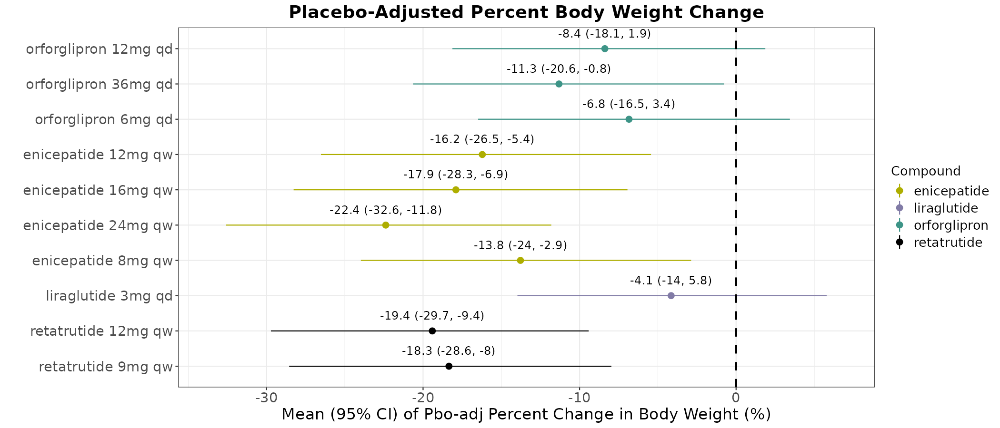
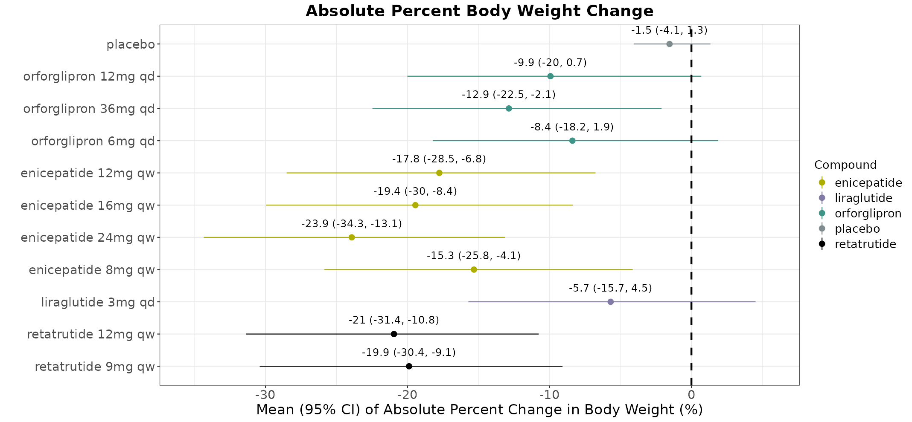

# Introduction

Bayesian network meta-analyses of weight-loss and related endpoints across
the GLP-1/GIP/amylin competitive landscape are a recurring analytical need
within Cardiometabolic Health. These analyses pool evidence across many
studies and compounds into a single, comparable forest plot of relative and
absolute treatment effects, and they need to be run — and re-run — as new
studies and data extracts become available. This document introduces
`/cmh-ci`, a Claude Code skill built to guide a statistician through that
process end-to-end: from a raw PRD/QA data extract, through study
selection, to a fitted Bayesian network meta-analysis (BNMA) and a
reportable result.

## How `/cmh-ci` works, at a glance

Every session opens with a landing page (@fig-landing-page) that explains
this workflow before touching any data. From there, the skill runs in
seven steps:

```
1 ─ Read the PRD/QA data; list every study, compound, phase, and
    evidence tier.
2 ─ You pick the studies and compounds to include.
3 ─ The selected subset is presented for review — studies,
    compounds, treatments, phases — before anything runs.
    Naming overlaps or inconsistencies get a call-out.
4 ─ You say whether outside data (press release, publication link,
    digitized slide, another workbook) goes into the BNMA.
5 ─ Any outside data is mapped to the QA schema and merged — you
    confirm the rows.
6 ─ You choose random- or fixed-effects for the BNMA.
7 ─ Fit, then output: a placebo-adjusted forest plot, an
    absolute forest plot, a re-runnable .Rmd, and an .html
    report.
```

Stopping after any step is a valid outcome — reviewing or updating the
data without fitting a model is a complete session on its own.

{#fig-landing-page}

<!-- TODO: swap in the real landing-page screenshot once attached -->

# Problem Statement

Before this skill existed, these analyses were produced by running a
hand-edited R script against a landscape dataset. The set of studies to
include, exclude, or pool together lived as a manually maintained
exclusion vector inside the script itself, often accumulating
commented-out lines with no record of why a given study was in or out.
Changing which studies, compounds, or evidence to consider meant editing
that vector directly — a manual step with no structured review before a
model was ever fit.

That difficulty is compounded by the shape of the underlying data itself.
Studies live across two tiers — a curated, periodically refreshed PRD
(production) extract, and a QA (working) tier where new or not-yet-promoted
data is actually added — and within a single workbook, evidence is further
split across separate Observed and Prediction sheets, each with its own
studies, phases, and evidence type. Filenames are dated, and a newer
extract can land at any time; treatment and compound names are not always
spelled or split identically across rows, and the same underlying study
can occasionally appear, differently dosed, in both the Observed and
Prediction tiers. None of this is really about how to run a Bayesian
network meta-analysis — it's the substantial amount of context a
statistician has to resolve correctly just to know what they're actually
feeding into one.

`/cmh-ci` exists to close that gap. Rather than assuming the user already
knows how to locate the right file, reconcile naming across tiers, and
assemble a correct model input by hand, it guides them through the entire
process — introducing what's actually in the data, selecting and
confirming a study subset, optionally incorporating outside data, and
fitting the model — as a structured, end-to-end conversation rather than a
script they have to already understand and edit themselves.

# Methods

<!--
  One subsection per workflow step, prose explainer (no code), followed
  by a subsection on the underlying statistical model. Numbers below
  match SKILL.md's own Step 1-7 numbering.
-->

## Step 1: Introducing the data and selecting studies

The skill locates the most recently dated PRD extract in the shared
PRD/QA obesity/weight directory, reads both the Observed and Prediction
sheets, and lists every study together with its phase, route, compound,
and treatment arms. Before presenting anything, it runs a deterministic
naming/pooling check across the two tiers: an exact `study_name`
collision between Observed and Prediction, and a same-compound
near-duplicate name across tiers (e.g. an Observed/Prediction pair whose
identifiers differ only by a tier-specific suffix), so any tier ambiguity
is visible from the very first message rather than surfacing later as a
duplicated study in a fitted model. The statistician then picks which
studies and compounds to include; naming a specific study or compound up
front is honored directly rather than re-asked.

## Step 2: Deciding whether to add outside data

The skill asks explicitly whether any additional, non-PRD/QA data — a
press release, a new readout, hand-digitized data, another workbook, or
a link to a publication — should be folded in before fitting. Answering
no is a complete, valid outcome: if all the statistician wanted was to
review or select from the existing PRD/QA data, the session ends here.

## Step 3: Converting outside data into the QA schema

When outside data is supplied — especially a link — the skill extracts
study data directly from the source, generically across publications,
press releases, or other web pages. It flags any population/scope
mismatch against the current dataset explicitly (for example, a
T2D-population study surfaced against a non-T2D dataset) rather than
noting it quietly, and asks whether each extracted study is Observed or
Predicted rather than inferring it. The mapped rows are shown back to the
statistician in the same schema as the QA workbook itself, with any field
that can't be confidently determined left blank rather than guessed.
Standard error is the notable exception: when a source reports no
confidence interval or SE at all, the skill can compute an approximate
fallback (`fallback_sd / sqrt(n)`, rounded to two decimal places) and
records exactly how that number was derived.

## Step 4: Merging outside data

Once the mapped rows are confirmed, they are appended into the QA
workbook, and the QA file's own name is updated to reflect the date data
was last added. This loops back to Step 2's question — anything else to
add? — until the statistician confirms the assembled subset is
sufficient.

## Step 5: Confirming the run and building the model input

Before any model is fit, the skill asks explicitly whether the goal is
actually a full analysis run — reviewing the data, or getting new data
into QA, is itself a complete outcome, not a lesser one. Only on
confirmation does it create the QA-rooted working folders for this run
and write a manifest recording exactly which studies are included.
Nothing needs to be explicitly excluded, only what should be included,
and a study named in the manifest that no longer matches the data (a
typo, or a study renamed upstream) is treated as a hard stop rather than
a silent omission.

## Step 6: Choosing a modelling approach

The statistician is asked once, directly, whether the network should be
fit as random-effects (the default, allowing the treatment effect to
vary study to study) or fixed-effect (assuming one common effect,
typically reserved for a star-shaped network where a shared heterogeneity
term can't be reliably estimated). This is asked only after the
network's structure is already known from the confirmed study selection,
so any recommendation reflects the real network rather than a guess made
before the data was seen. The choice is final for this run.

## Step 7: Fitting the model and producing outputs

The model is fit once via JAGS, and both a placebo-adjusted and an
absolute-effect forest plot are produced from that same fit in a single
pass — neither is a separate ask. Alongside the two plots, the skill
writes a re-runnable `.Rmd` report — real, executable code chunks a
statistician can step through in RStudio — and renders it to a companion
`.html` file for anyone who just wants to read the result. Together, the
`.Rmd`/`.html` pair is the permanent, reproducible record of exactly
which data, which studies, and which modelling choices produced the
plots.

## The underlying model

At its core, `/cmh-ci` fits a Bayesian network meta-analysis using the
same model specification as Lilly's production `CMH.BNMA` Shiny
application. Each study $i$ contributes one or more arms $j$, and the
arm-level effect estimate $y_{i,j}$ (with its reported or derived
standard error $se_{i,j}$) is modelled as:

$$
y_{i,j} \sim \text{Normal}\left(\eta_{i,j},\ se_{i,j}^2\right)
$$

where $\eta_{i,j}$ is a linear predictor built from a study-specific
baseline $\phi_i$ and a treatment effect $\delta_{i,j}$ relative to that
study's own placebo/reference arm:

$$
\eta_{i,j} = \phi_i + \delta_{i,j}
$$

Two independent modelling choices govern how $\phi_i$ and $\delta_{i,j}$
are specified, and together they define the four network-model variants
the skill can select between:

- **Baseline ($\phi_i$)** — either a flat, study-specific prior,
  $\phi_i \sim \text{Normal}(0, 10^{-4})$, used for the relative
  (placebo-adjusted) analysis; or a hierarchical, pooled baseline,
  $\phi_i \sim \text{Normal}(m, \tau_m^2)$ with its own mean $m$ and
  between-study variance $\tau_m^2$, used when an absolute — not just
  placebo-adjusted — effect is needed.
- **Treatment effect ($\delta_{i,j}$)** — either random-effects,
  $\delta_{i,j} \sim \text{Normal}(d_k, \sigma^2)$ with a shared
  heterogeneity standard deviation $\sigma \sim \text{Uniform}(0, 8)$
  (the default); or fixed-effect, $\delta_{i,j} = d_k$, used for a
  star-shaped network where $\sigma$ cannot be reliably estimated.

$d_k$ is the summary treatment effect for treatment $k$ relative to the
network's reference arm (placebo), with a vague prior
$d_k \sim \text{Normal}(0, 100^2)$; it is these $d_k$ values, together
with their 95% credible intervals, that are plotted in the
placebo-adjusted forest plot. Multi-arm studies (three or more arms in
the same trial) receive a small correlation correction so their arms
aren't treated as independent evidence twice over.

For the absolute-effect forest plot, a fifth, pooled-placebo model is fit
separately against only the placebo/reference arms across studies,
giving a pooled baseline mean $m$; the absolute effect for treatment $k$
is then simply $m + d_k$.

All four network-model variants share this same likelihood and priors —
they differ only in the two toggles above — and every model is fit using
the same MCMC settings: 3 chains, 10,000 adaptation iterations, 10,000
burn-in iterations, and 20,000 sampling iterations thinned by 10,
matching `EliLillyCo/CMH.BNMA`'s own documented specification.

# Results

Fitting the workflow above against the `cwm_wl_nont2d` PRD/QA dataset
(run of 2026-08-28) produces the two forest plots below: a
placebo-adjusted (relative) effect plot (@fig-relative) and an absolute
effect plot (@fig-absolute), covering four compounds — enicepatide,
orforglipron, retatrutide, and liraglutide — across their studied doses.

@fig-relative shows each dose's mean percent change in body weight
relative to placebo, with its 95% credible interval. Reading the plot: a
point estimate further to the left is a larger placebo-adjusted
weight-loss effect, and an interval that does not cross zero indicates
the effect is distinguishable from placebo at the 95% credible level.
@fig-absolute shows the same doses on an absolute scale, alongside a
pooled placebo estimate of −1.5% (95% CI: −4.1, 1.3) — this is the
$m + d_k$ construction described in Methods, not a second, independent
fit.

::: {#fig-forest-plots layout-ncol="2"}
{#fig-relative}

{#fig-absolute}

Relative and absolute forest plots from a `/cmh-ci` run on the
`cwm_wl_nont2d` dataset (2026-08-28).
:::

::: {.callout-note title="Key findings from this run"}
- **Enicepatide 24mg qw** shows the largest placebo-adjusted effect in
  this dataset, at −22.4% (95% CI: −32.6, −11.8), and its interval
  excludes zero at every studied dose (8mg, 12mg, 16mg, 24mg qw).
- **Retatrutide**, at both studied doses (9mg and 12mg qw), also shows
  large effects whose intervals exclude zero: −18.3% (−28.6, −8.0) and
  −19.4% (−29.7, −9.4) respectively.
- **Orforglipron**'s effect is dose-dependent: its lower and middle doses
  (6mg, 12mg qd) have intervals that still include zero in this run
  (−6.8%, 95% CI −16.5 to 3.4; and −8.4%, 95% CI −18.1 to 1.9), while its
  highest dose (36mg qd) does not (−11.3%, 95% CI −20.6 to −0.8).
- **Liraglutide 3mg qd**'s interval also includes zero here (−4.1%, 95%
  CI −14.0 to 5.8).
:::

These figures — and the numbers behind them — come from one specific,
real `/cmh-ci` run; a different study selection or a different data
extract would produce different results. What doesn't change is the pair
of outputs every run produces: the two plots above, plus the re-runnable
`.Rmd` and its rendered `.html` companion described in Methods, which
together record exactly how these particular numbers were produced.

# Summary

`/cmh-ci` turns the earlier, manually maintained analysis script into a
guided, seven-step conversation: it introduces the PRD/QA landscape
before asking for any decision, runs a deterministic naming/pooling check
across the Observed and Prediction tiers before a model is ever fit, and
only proceeds to a BNMA once the statistician has explicitly confirmed
both the study selection and the intent to run one. The underlying
statistical model — a shared likelihood with two toggles selecting
between placebo-adjusted/absolute and random-/fixed-effects variants —
matches Lilly's production `CMH.BNMA` application verbatim, so a result
produced this way is not a new or separate model, just a guided,
auditable path to the same one. Every completed run leaves behind the
same two things: the forest plots themselves, and a re-runnable
`.Rmd`/`.html` report pair that records exactly which data and which
decisions produced them — the audit trail the earlier, hand-edited-script
workflow never had.
