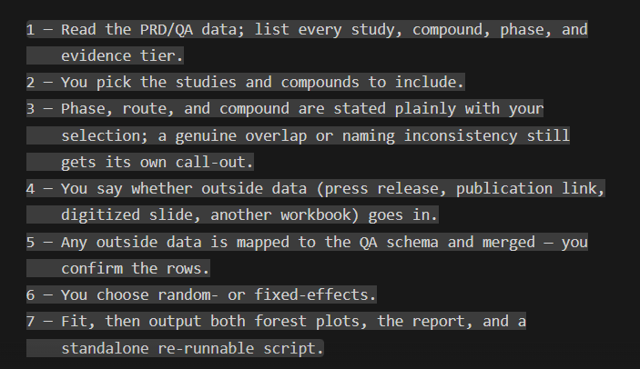
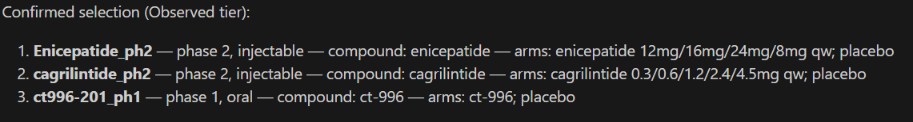
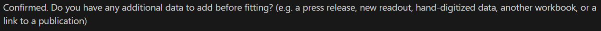
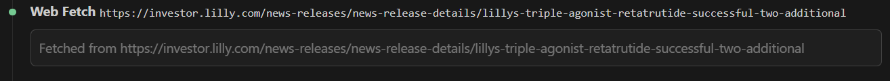
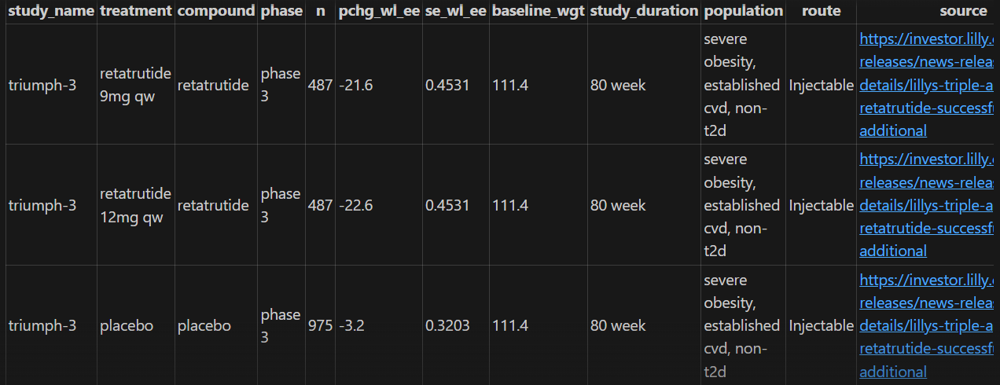
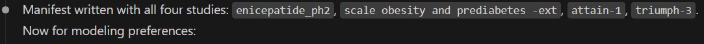
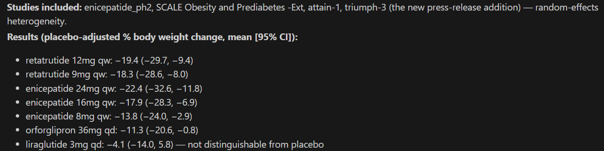

# Introduction

Bayesian network meta-analyses of weight-loss and related endpoints across
the GLP-1/GIP/amylin competitive landscape are a recurring analytical need
within Cardiometabolic Health. These analyses pool evidence across many
studies and compounds into a single, comparable forest plot of relative and
absolute treatment effects, and they need to be run — and re-run — as new
studies and data extracts become available.

A **Bayesian Network Meta-Analysis** (BNMA) combines evidence from multiple
clinical trials to estimate how different treatments compare — even when
those treatments were never tested head-to-head. It works by linking trials
through shared comparators (typically placebo), forming a "network" of
indirect comparisons. At Lilly, the CMH team uses BNMAs to build the
**competitive landscape** — understanding where our compounds stand relative
to competitors across the obesity and diabetes portfolio. The primary
deliverable is a forest plot showing placebo-adjusted weight loss (or other
endpoints like HbA1c) for every treatment in the network, with Bayesian
credible intervals. These plots inform competitive intelligence decks,
regulatory strategy, and clinical development decisions.

This document introduces `/cmh-ci`, a Claude Code skill built to guide a
statistician through that process end-to-end: from a raw PRD/QA data
extract, through study selection, to a fitted BNMA and a reportable result.


# Prerequisites

You're working on the Lilly HPC cluster, so the heavy dependencies (R, JAGS, and all required R packages) are already installed — nothing to set up. The skill loads them automatically via `module load` when it runs.

| What you need | Notes |
|---|---|
| **Claude Code** | The CLI — `claude --version` to confirm |
| **HPC cluster session** | SSH'd in or on a compute node |
| **Data access** | Read access to `/lillyce/prd/` and `/lillyce/qa/` |

That's it. R (4.4.2), JAGS (4.3.2), and all R packages (`rjags`, `coda`, `dplyr`, `readxl`, `ggplot2`, `openxlsx`, `rmarkdown`) are available cluster-wide via modules and the shared R library.


# Getting Started

## Setup

The skill is already deployed in the shared QA data directory:

```
/lillyce/qa/diabetes/bnma/obesity/data/shared/
└── .claude/skills/cmh-ci/
    ├── SKILL.md     ← the skill definition
    └── CLAUDE.md    ← project-level pointer
```

Any Claude Code session launched from within `/lillyce/qa/diabetes/bnma/obesity/data/shared/` (or a subdirectory) will pick it up automatically — no install step needed.

## Starting a session

```bash
cd /lillyce/qa/diabetes/bnma/obesity/data/shared   # or a subdirectory
claude                                              # launch Claude Code
```

Then type `/cmh-ci`.


# The Workflow

```{mermaid}
%%| fig-cap: "The /cmh-ci workflow"
flowchart LR
    A["/cmh-ci"] --> B["Review data\n& pick studies"]
    B --> C{"New data?"}
    C -->|yes| D["Append to QA"]
    C -->|no| E["Configure\n& fit model"]
    D --> E
    E --> F["Forest plots\n+ .Rmd + .html"]

    style A fill:#4A90D9,color:#fff
    style F fill:#2ECC71,color:#fff
```

Every `/cmh-ci` invocation starts with a landing page explaining the seven steps. Nothing is read, written, or assumed until you confirm.

{#fig-landing fig-align="center" width="80%"}

## Step 1: Introducing the data and selecting studies

The skill locates the most recently dated PRD extract, reads both the
Observed and Prediction sheets, and lists every study together with its
phase, route, compound, and treatment arms. Before presenting anything, it
runs a naming/pooling check across the two tiers — an exact `study_name`
collision, or a same-compound near-duplicate whose identifiers differ only
by a tier-specific suffix — so any ambiguity is visible from the first
message rather than surfacing later as a duplicated study in a fitted model.

Example output:

```
Sheet: Observed | Rows: 42

  1. scale maintenance (phase 3, injectable, observed)
     -- semaglutide
       semaglutide 2.4 mg; placebo

  2. believe (phase 3, injectable, observed)
     -- tirzepatide
       tirzepatide 10 mg; tirzepatide 15 mg; tirzepatide 5 mg; placebo
  ...
```

You then pick which studies to include — by name, by compound, or confirm the full list.

{#fig-subset fig-align="center" width="80%"}

## Step 2: Deciding whether to add outside data

The skill asks explicitly whether any additional, non-PRD/QA data — a
press release, a new readout, hand-digitized data, another workbook, or
a link to a publication — should be folded in before fitting. Answering
no is a valid outcome: the skill skips straight to model configuration.

{#fig-additional fig-align="center" width="80%"}

The example below continues with a real "yes" — adding a press release
about a new study (`triumph-3`) to three studies already selected in
Step 1.

## Steps 3–4: Converting and merging outside data

When outside data is supplied — especially a link — the skill extracts
study data directly from the source, flags any population/scope mismatch
explicitly (e.g. a T2D study against a non-T2D dataset), and asks whether
each extracted study is Observed or Predicted rather than inferring it.

{#fig-webfetch fig-align="center" width="80%"}

The mapped rows are shown back in the QA schema for confirmation — here,
the real rows extracted from that press release for `triumph-3`:

{#fig-previewrows fig-align="center" width="80%"}

Once confirmed, rows are appended to the QA workbook, and the QA file is
renamed so the date reflects when data was last added:

```
cwm_wl_nont2d_qa_20260827.xlsx  →  cwm_wl_nont2d_qa_20260901.xlsx
```

:::{.callout-important}
The QA file rename is an in-place `mv` — one file at a time, no old copies left behind. The skill tracks the new filename for all subsequent steps.
:::

This loops back to Step 2 — anything else to add? — until you confirm
the subset is sufficient.

## Step 5: Confirming the run and building the model input

Before any model is fit, the skill asks whether the goal is actually a
full analysis run — reviewing the data, or getting new data into QA, is
itself a complete outcome. Only on confirmation does it create working
folders and write a manifest recording exactly which studies are included.
A study in the manifest that doesn't match the data (a typo, or a study
renamed upstream) is a hard stop, not a silent omission.

{#fig-manifest fig-align="center" width="80%"}

## Step 6: Choosing a modelling approach

The statistician is asked once, directly: **random-effects** (the default)
or **fixed-effect**?

:::{.callout-warning}
## Star network detection

If every non-placebo treatment comes from exactly one study (a "star"
network), the skill warns:

> *"Full star network detected — σ cannot be estimated, CIs will be
> prior-inflated with random-effects. Recommend fixed-effect."*

This is a recommendation, not an override — you choose. The decision is
final for this run.
:::

## Step 7: Fitting the model and producing outputs

The model is fit once via JAGS, and both forest plots are produced from
that same fit in a single pass — no separate R processes, no re-reading
data. Alongside the plots, the skill writes a re-runnable `.Rmd` report
and renders it to `.html`.

```bash
# What's happening under the hood:
module load R/4.4.2 jags 2>/dev/null
Rscript /tmp/$USER/cmh_ci_lib/run_bnma_pipeline.R \
  --prd <prd_path> --qa <qa_path> \
  --manifest <manifest.yaml> --model model_random.txt \
  --cache /tmp/$USER/cmh_ci_lib/samples.rds \
  --fit-placebo --placebo-cache /tmp/$USER/cmh_ci_lib/placebo_samples.rds \
  --plot --effect both \
  --plot-out <output_folder>/forest_plot_relative.png \
  --plot-out-absolute <output_folder>/forest_plot_absolute.png
```

Both forest plots are displayed immediately in the terminal, alongside a
plain-language chat summary. Continuing the worked example above (the
three Step 1 studies plus the `triumph-3` press-release addition):

{#fig-summary fig-align="center" width="80%"}


# Data

## PRD/QA workbook structure

The PRD and QA workbooks share the same schema. Each file has two data sheets — **Observed** (from completed trials) and **Prediction** (model-projected from earlier-phase data) — plus a Summary sheet.

**Key columns** (grouped by role):

| Group | Columns | What they hold |
|---|---|---|
| **BNMA inputs** | `pchg_wl_ee`, `se_wl_ee` | % weight change (efficacy estimand) and its SE — **the two columns the model fits on** |
| **Study identity** | `study_name`, `treatment`, `compound`, `phase` | Which study, arm, molecule, and trial phase |
| **Design** | `n`, `baseline_wgt`, `study_duration`, `aom`, `population` | Sample size, baseline weight, duration, route (Oral/Injectable), population scope |
| **Alternate estimand** | `pchg_wl_tre`, `se_wl_tre` | Treatment-regimen estimand (secondary) |
| **Provenance** | `time_entry`, `source`, `data_type`, `sponsor` | When curated, citation/URL, source type, sponsor |
| **Curation** | `curator_name`, `curator_note`, `qc_name`, `qc_note`, `derivation_spec`, `analysis_method` | Audit trail — who curated, QC'd, and how values were derived |

:::{.callout-important}
Every treatment arm must have both **`pchg_wl_ee`** and **`se_wl_ee`**. If SE is not reported, it can be approximated as `fallback_sd / sqrt(n)` — the skill helps compute this during data entry.
:::

## How PRD and QA relate

```{mermaid}
%%| fig-cap: "PRD vs QA data flow"
flowchart LR
    A["PRD\n(read-only)"] --> C["Merge"] --> D["BNMA → plots"]
    B["QA\n(new data here)"] --> C
    style A fill:#3498DB,color:#fff
    style B fill:#E67E22,color:#fff
```

- **PRD** (`/lillyce/prd/...`) — the validated, production-tier dataset. Read-only. Updated periodically by the team through the normal curation process.
- **QA** (`/lillyce/qa/...`) — the living working copy. New data lands here first via the skill's append flow, then eventually gets promoted to PRD through team review.

When fitting, QA rows override PRD rows for the same `study_name` + `treatment` (by keeping the row with the latest `time_entry`).


# Statistical Methods

## The BATMAN data structure

Before fitting, the skill converts the tabular data into **BATMAN matrices** — the input format JAGS expects:

| Symbol | Dimension | Meaning |
|---|---|---|
| $y_{ij}$ | $ns \times \max(n_a)$ | Observed effect (% weight change) for study $i$, arm $j$ |
| $se_{ij}$ | $ns \times \max(n_a)$ | Standard error of $y_{ij}$ |
| $trt_{ij}$ | $ns \times \max(n_a)$ | Treatment index for study $i$, arm $j$ (1 = placebo) |
| $n_a[i]$ | $ns$ | Number of arms in study $i$ |
| $ns$ | scalar | Total number of studies |
| $M$ | scalar | Total number of treatments (including placebo) |

## The underlying model

At its core, `/cmh-ci` fits a BNMA using the same model specification as
Lilly's production `CMH.BNMA` Shiny application. Each study $i$ contributes
one or more arms $j$, and the arm-level effect estimate is modelled as:

$$
y_{i,j} \sim \text{Normal}\!\left(\eta_{i,j},\ se_{i,j}^2\right)
$$

where $\eta_{i,j}$ is a linear predictor built from a study-specific
baseline $\phi_i$ and a treatment effect $\delta_{i,j}$:

$$
\eta_{i,j} = \phi_i + \delta_{i,j}
$$

Two independent modelling choices govern how $\phi_i$ and $\delta_{i,j}$
are specified, and together they define the four network-model variants:

- **Baseline ($\phi_i$)** — either a flat, study-specific prior,
  $\phi_i \sim \text{Normal}(0, 10^{4})$, used for the relative
  (placebo-adjusted) analysis; or a hierarchical, pooled baseline,
  $\phi_i \sim \text{Normal}(m, \tau_m^2)$ with its own mean $m$ and
  between-study variance $\tau_m^2$, used when an absolute effect is
  needed.
- **Treatment effect ($\delta_{i,j}$)** — either random-effects,
  $\delta_{i,j} \sim \text{Normal}\!\big((d_{t_{ij}} - d_{t_{i1}}) + sw_{ij},\ \tau^2 \cdot \tfrac{2(j-1)}{j}\big)$
  with a shared heterogeneity $\sigma \sim \text{Uniform}(0, 8)$
  (the default); or fixed-effect,
  $\delta_{i,j} = (d_{t_{ij}} - d_{t_{i1}}) + sw_{ij}$, used for star
  networks where $\sigma$ cannot be reliably estimated.

$d_k$ is the summary treatment effect for treatment $k$ relative to placebo
($d_1 = 0$), with a vague prior $d_k \sim \text{Normal}(0, 10^{4})$ — these
$d_k$ values and their 95% credible intervals are what the placebo-adjusted
forest plot displays. The $sw_{ij}$ term is the multi-arm correction
(Higgins & Whitehead, 1996) ensuring correlated arms within the same trial
aren't treated as independent evidence.

:::{.callout-note}
The $\sigma$ parameter captures **between-study heterogeneity** — how much the treatment effect varies across studies beyond sampling error. A larger $\sigma$ means wider credible intervals. In a star network (one study per treatment), $\sigma$ cannot be estimated from the data and the model falls back on its prior, inflating the intervals — this is why fixed-effect is recommended for star networks.
:::

For the absolute-effect forest plot, a separate pooled-placebo model is fit
against only the placebo arms:

$$
y^{\text{pbo}}_i \sim \text{Normal}\!\big(\mu_{s_i},\ se^{\text{pbo}}_i{}^2\big), \qquad
\mu_i \sim \text{Normal}(m, \sigma_m^2), \qquad
\mu_{\text{new}} \sim \text{Normal}(m, \sigma_m^2)
$$

The absolute effect for treatment $k$ is then $\mu_{\text{new}} + d_k$.

## Model variants

| Model | Baseline $\phi_i$ | Treatment $\delta_{ij}$ | Use for |
|---|---|---|---|
| `model_random.txt` **(default)** | flat prior | random-effects | Standard placebo-adjusted forest |
| `model_fixed.txt` | flat prior | fixed-effect | Star networks / sensitivity check |
| `model_simultaneous.txt` | pooled hierarchical | random-effects | Absolute-effect forest |
| `model_simultaneous_fixed.txt` | pooled hierarchical | fixed-effect | Absolute forest on star networks |
| `model_placebo_random.txt` | — | — | Pooled placebo baseline |

## MCMC settings

All models are fit with the same settings, matching `EliLillyCo/CMH.BNMA`:

| Parameter | Value |
|---|---|
| Adaptation | 10,000 |
| Burn-in | 10,000 |
| Iterations | 20,000 |
| Thinning | 10 |
| Chains | 3 |
| **Effective samples** | **6,000** |


# Results

Fitting the workflow above against the `cwm_wl_nont2d` PRD/QA dataset
(run of 2026-08-28) produces the two forest plots below: a
placebo-adjusted (relative) effect plot (@fig-relative) and an absolute
effect plot (@fig-absolute).

@fig-relative shows each dose's mean percent change in body weight
relative to placebo, with its 95% credible interval. A point estimate
further to the left is a larger weight-loss effect; an interval that does
not cross zero indicates the effect is distinguishable from placebo.
@fig-absolute shows the same doses on an absolute scale — the
$\mu_{\text{new}} + d_k$ construction described in Statistical Methods.

::: {#fig-forest-plots layout-ncol="2"}
{#fig-relative}

{#fig-absolute}

Relative and absolute forest plots from a `/cmh-ci` run on the
`cwm_wl_nont2d` dataset (2026-08-28).
:::

::: {.callout-note title="Key findings from this run"}
- **Enicepatide 24mg qw** shows the largest placebo-adjusted effect,
  at −22.4% (95% CI: −32.6, −11.8), and its interval excludes zero at
  every studied dose.
- **Retatrutide** at both doses (9mg and 12mg qw) also shows large
  effects: −18.3% (−28.6, −8.0) and −19.4% (−29.7, −9.4).
- **Orforglipron** is dose-dependent: its lower doses (6mg, 12mg qd) have
  intervals including zero, while its highest (36mg qd) does not
  (−11.3%, 95% CI −20.6 to −0.8).
- **Liraglutide 3mg qd**'s interval includes zero (−4.1%, 95% CI −14.0
  to 5.8).
:::

These figures come from one specific run; a different study selection or
data extract would produce different results. What doesn't change is the
set of outputs every run produces — the two plots plus the `.Rmd`/`.html`
pair that records exactly how these numbers were produced.


# Understanding the Outputs

## The .Rmd report

The `.Rmd` is not just documentation — **it is the re-runnable analysis
script**. It contains six R code chunks:

| Chunk | What it does |
|---|---|
| **1. Setup** | Load libraries, define paths, config variables |
| **2. Data load** | Read PRD/QA, merge, filter to included studies |
| **3. Build BATMAN** | Construct JAGS matrices ($y$, $se$, $trt$, $n_a$, $ns$, $M$) |
| **4. Fit model** | JAGS model definition, `jags.model()`, burn-in, `coda.samples()` |
| **5. Results** | Extract posteriors, build result table, fit pooled-placebo |
| **6. Forest plots** | Render both relative and absolute, save PNGs |

To re-run an analysis: open `report.Rmd` in RStudio, ensure
`module load R/4.4.2 jags` is active, and run chunks sequentially
(Ctrl+Shift+Enter). Edit paths or study lists as needed, then re-run.

:::{.callout-tip}
Each chunk is self-contained enough to re-run from any point if the earlier objects are in your workspace. Want to re-render plots with different styling? Jump straight to Chunk 6.
:::

## The .html report

The `.html` is a pre-rendered readable version — shareable by email or on
SharePoint, no R needed. It contains the data provenance, study list,
design choices, all six code chunks (displayed but not executed), and
links to the output plots.

Both files live in the programs folder:

```
/lillyce/qa/diabetes/bnma/obesity/programs/YYYYMMDD_<slug>/
  ├── report.Rmd
  └── report.html
```


# Common Scenarios

### "I just want to see what's in the data"

Type `/cmh-ci`, confirm the landing page, review the study listing in
Step 1. When asked about new data or running the BNMA, say **no**. Nothing
is written, no folders created.

### "I have a new press release to add"

Run `/cmh-ci` through the full flow. At Step 2, say **yes** and paste the
link or data. The skill maps it to QA schema, shows rows for confirmation,
appends and renames the QA file. Then fit the BNMA or stop there.

### "Re-run last month's analysis with updated data"

Open the previous run's `report.Rmd` in RStudio. Update file paths in
Chunk 1 if they've changed, then run all chunks. Or run `/cmh-ci` fresh —
it picks up the latest PRD and QA files automatically.

### "Switch from random-effects to fixed-effects"

At Step 6, choose **fixed-effect**. Or edit `model_type` in an existing
`report.Rmd` and re-run from Chunk 4.


# File Locations

| What | Path |
|---|---|
| PRD data | `/lillyce/prd/diabetes/bnma/obesity/data/shared/weight/cwm_wl_nont2d_prd_YYYYMMDD.xlsx` |
| QA data | `/lillyce/qa/diabetes/bnma/obesity/data/shared/weight/cwm_wl_nont2d_qa_YYYYMMDD.xlsx` |
| Programs (per run) | `/lillyce/qa/diabetes/bnma/obesity/programs/YYYYMMDD_<slug>/` |
| Output (per run) | `/lillyce/qa/diabetes/bnma/obesity/output/shared/YYYYMMDD_<slug>/` |
| Skill (deployed) | `/lillyce/qa/diabetes/bnma/obesity/data/shared/.claude/skills/cmh-ci/SKILL.md` |


# FAQ

### "R or JAGS not found"

The skill loads modules automatically. If it fails, check availability:
`module avail R` / `module avail jags`. If you're on a login node without
modules, connect to a compute node first.

### "Star network detected — what does this mean?"

Every non-placebo treatment comes from exactly one study. The heterogeneity
parameter $\sigma$ can't be estimated — the model relies on its prior,
inflating credible intervals. Switching to **fixed-effect** removes $\sigma$
and gives tighter, more interpretable intervals.

### "The skill takes too long"

The JAGS MCMC fit is the bottleneck (~3–5 min for a typical network). This
matches the production `CMH.BNMA` app's runtime. Everything else takes
seconds.

### "Can I edit the .Rmd and re-render?"

Yes — that's the point. Modify what you need, re-run chunks, then:

```bash
module load R/4.4.2
Rscript -e 'rmarkdown::render("report.Rmd", output_format = "html_document")'
```

### "Where did my QA file go?"

When you append new data, the QA file is **renamed** to today's date.
There's always exactly one file:

```bash
ls -lt /lillyce/qa/diabetes/bnma/obesity/data/shared/weight/cwm_wl_nont2d_qa_*.xlsx
```


# Summary

`/cmh-ci` turns the earlier, manually maintained analysis script into a
guided, seven-step conversation: it introduces the PRD/QA landscape
before asking for any decision, runs a deterministic naming/pooling check
across the Observed and Prediction tiers before a model is ever fit, and
only proceeds to a BNMA once the statistician has explicitly confirmed
both the study selection and the intent to run one. The underlying
statistical model — a shared likelihood with two toggles selecting
between placebo-adjusted/absolute and random-/fixed-effects variants —
matches Lilly's production `CMH.BNMA` application verbatim, so a result
produced this way is not a new or separate model, just a guided,
auditable path to the same one. Every completed run leaves behind the
same deliverables: the forest plots themselves, and a re-runnable
`.Rmd`/`.html` report pair that records exactly which data and which
decisions produced them — the audit trail the earlier, hand-edited-script
workflow never had.
