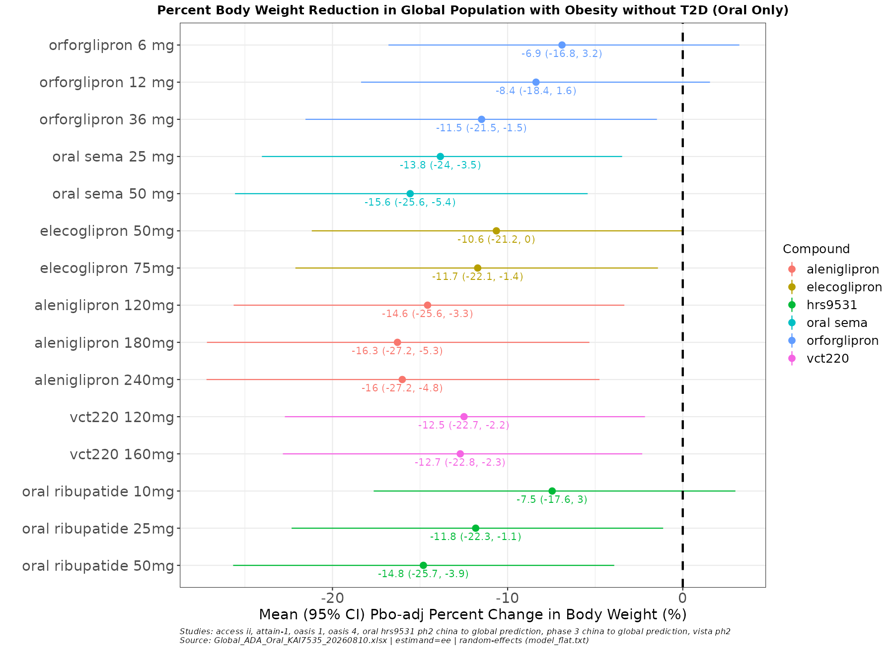

## Overview

### What is a BNMA?

A **Bayesian Network Meta-Analysis** (BNMA) combines evidence from multiple clinical trials to estimate how different treatments compare — even when those treatments were never tested head-to-head. It works by linking trials through shared comparators (typically placebo), forming a "network" of indirect comparisons.

At Lilly, the Cardiometabolic Health (CMH) team uses BNMAs to build the **competitive landscape** — understanding where our compounds stand relative to competitors across the obesity and diabetes portfolio. The primary deliverable is a **forest plot** showing placebo-adjusted weight loss (or other endpoints like HbA1c) for every treatment in the network, with Bayesian credible intervals. These plots inform competitive intelligence decks, regulatory strategy, and clinical development decisions.

The underlying statistical engine is **JAGS** (Just Another Gibbs Sampler), which fits hierarchical Bayesian models via Markov Chain Monte Carlo (MCMC) sampling. The production reference implementation is the `EliLillyCo/CMH.BNMA` Shiny app — this skill matches its model specifications and MCMC settings exactly.

### What `/cmh-ci` does

`/cmh-ci` is a Claude Code skill that automates the end-to-end BNMA pipeline. It replaces the manual process of assembling study data, writing JAGS scripts, and generating forest plots — a workflow that previously required editing hardcoded study lists and running multiple scripts by hand.

The skill walks you through the full pipeline interactively:

1. **Read** the PRD/QA dataset and show you what's in it
2. **Select** which studies and compounds to include
3. **Add** new data from press releases or publications (optional)
4. **Fit** a BNMA model using JAGS
5. **Output** four deliverables:
   - Placebo-adjusted (relative) forest plot
   - Absolute forest plot
   - Re-runnable `.Rmd` (open in RStudio, run chunk-by-chunk)
   - Pre-rendered `.html` report (share immediately)

:::{.callout-tip}
You don't have to run the full analysis. Stopping after Step 1 (reviewing the data) or after adding new data to QA are both valid, complete sessions.
:::


## Prerequisites

You're working on the Lilly HPC cluster, so the heavy dependencies (R, JAGS, and all required R packages) are already installed — nothing to set up. The skill loads them automatically via `module load` when it runs.

| What you need | Notes |
|---|---|
| **Claude Code** | The CLI — `claude --version` to confirm |
| **HPC cluster session** | SSH'd in or on a compute node |
| **Data access** | Read access to `/lillyce/prd/` and `/lillyce/qa/` |

That's it. R (4.4.2), JAGS (4.3.2), and all R packages (`rjags`, `coda`, `dplyr`, `readxl`, `ggplot2`, `openxlsx`, `rmarkdown`) are available cluster-wide via modules and the shared R library — the skill handles the `module load` calls for you.


## Data Schema

### PRD/QA workbook structure

The PRD and QA workbooks share the same schema. Each file has two data sheets — **Observed** (from completed trials) and **Prediction** (model-projected from earlier-phase data) — plus a Summary sheet.

**Key columns** (grouped by role):

| Group | Columns | What they hold |
|---|---|---|
| **BNMA inputs** | `pchg_wl_ee`, `se_wl_ee` | % weight change (efficacy estimand) and its SE — **the two columns the model fits on** |
| **Study identity** | `study_name`, `treatment`, `compound`, `phase` | Which study, arm, molecule, and trial phase |
| **Design** | `n`, `baseline_wgt`, `study_duration`, `aom`, `population` | Sample size, baseline weight, duration, route (Oral/Injectable), population scope |
| **Alternate estimand** | `pchg_wl_tre`, `se_wl_tre` | Treatment-regimen estimand (secondary) |
| **Provenance** | `time_entry`, `source`, `data_type`, `sponsor` | When curated, citation/URL, source type, sponsor |
| **Curation** | `curator_name`, `curator_note`, `qc_name`, `qc_note`, `derivation_spec`, `analysis_method` | Audit trail — who curated, QC'd, and how values were derived |

:::{.callout-important}
Every treatment arm must have both **`pchg_wl_ee`** and **`se_wl_ee`**. If SE is not reported, it can be approximated as `fallback_sd / sqrt(n)` — the skill helps compute this during data entry.
:::

### How PRD and QA relate

```{mermaid}
%%| fig-cap: "PRD vs QA data flow"
flowchart LR
    A["PRD\n(read-only)"] --> C["Merge"] --> D["BNMA → plots"]
    B["QA\n(new data here)"] --> C
    style A fill:#3498DB,color:#fff
    style B fill:#E67E22,color:#fff
```

- **PRD** (`/lillyce/prd/...`) — the validated, production-tier dataset. Read-only. Updated periodically by the team through the normal curation process.
- **QA** (`/lillyce/qa/...`) — the living working copy. New data from press releases, publications, or other sources lands here first via the skill's append flow, then eventually gets promoted to PRD through team review.

When fitting, the pipeline merges both: QA rows override PRD rows for the same `study_name` + `treatment` (by keeping the row with the latest `time_entry`).


## Getting Started

### Option A: Global install (works from any folder)

Place the skill file at:

```
~/.claude/skills/cmh-ci/SKILL.md
```

Then `/cmh-ci` is available in every Claude Code session, regardless of which directory you're in.

### Option B: Project-level install (works for everyone in that folder)

Place the skill inside your project directory:

```
/lillyce/qa/diabetes/bnma/obesity/
├── .claude/
│   └── skills/
│       └── cmh-ci/
│           └── SKILL.md
└── CLAUDE.md            ← optional pointer (see below)
```

Anyone who opens Claude Code from this folder (or any subfolder) gets `/cmh-ci` automatically — no global install needed.

### The CLAUDE.md pointer

Drop a small `CLAUDE.md` in the project root so users know the skill exists:

```markdown
# CMH Competitive Intelligence — BNMA

Type `/cmh-ci` to run a Bayesian network meta-analysis on the PRD/QA
weight-loss dataset. It walks you through study selection, optional new
data, model fitting, and outputs both forest plots (placebo-adjusted +
absolute), a re-runnable .Rmd, and an .html report.
```

### Starting a session

```bash
cd /lillyce/qa/diabetes/bnma/obesity   # or your working directory
claude                                  # launch Claude Code
```

Then type:

```
/cmh-ci
```


## The Workflow — Step by Step

```{mermaid}
%%| fig-cap: "The /cmh-ci workflow"
flowchart LR
    A["/cmh-ci"] --> B["Review data\n& pick studies"]
    B --> C{"New data?"}
    C -->|yes| D["Append to QA"]
    C -->|no| E["Configure\n& fit model"]
    D --> E
    E --> F["Forest plots\n+ .Rmd + .html"]

    style A fill:#4A90D9,color:#fff
    style F fill:#2ECC71,color:#fff
```

### Landing page

Every `/cmh-ci` invocation starts with a banner explaining the 7-step workflow. Nothing is read, written, or assumed until you confirm:

```
════════════════════════════════════════════════════════════════════

                          /cmh-ci
        Bayesian Network Meta-Analysis · CMH Competitive Intelligence

════════════════════════════════════════════════════════════════════

From the PRD/QA weight-loss dataset to a fitted BNMA. This skill reads
the data, has you select studies and settle any conflicts, folds in any
outside data you supply, fits the model, and returns both forest plots
(placebo-adjusted and absolute), a re-runnable .Rmd, and an .html
report.

    1 ─ Read the PRD/QA data; list every study, compound, phase, ...
    2 ─ You pick the studies and compounds to include.
    3 ─ The selected subset is presented for review ...
    ...
    7 ─ Fit, then output: a placebo-adjusted forest plot, an
        absolute forest plot, a re-runnable .Rmd, and an .html report.

────────────────────────────────────────────────────────────────────
  Shall I read the PRD dataset and list the studies?   ( yes / no )
────────────────────────────────────────────────────────────────────
```

Type **yes** to proceed.

### Step 1: Dataset review

The skill finds the most recent PRD file and reads both sheets (Observed and Prediction):

```
PRD: /lillyce/prd/diabetes/bnma/obesity/data/shared/weight/
     cwm_wl_nont2d_prd_20260805.xlsx
```

It lists every study with its compound, phase, route, and evidence tier:

```
Sheet: Observed | Rows: 42

  1. scale maintenance (phase 3, injectable, observed)
     -- semaglutide
       semaglutide 2.4 mg; placebo

  2. believe (phase 3, injectable, observed)
     -- tirzepatide
       tirzepatide 10 mg; tirzepatide 15 mg; tirzepatide 5 mg; placebo

  ...

Sheet: Prediction | Rows: 18

  1. triumph-3 (phase 3, injectable, prediction)
     -- retatrutide
       retatrutide 12 mg; placebo
  ...
```

You then pick which studies to include. You can name them explicitly ("include all except harbor-1") or confirm the full list.

### Steps 2–4: Adding new data (the QA flow)

After study selection, the skill asks:

> *Do you have any additional data to add before fitting?*
> *(e.g. a press release, new readout, hand-digitized data, another workbook)*

:::{.callout-tip}
If you don't have new data, just say **no** — the skill skips straight to model configuration (Step 5).
:::

If you **do** have new data, the skill accepts it in any form:

- **Pasted rows** directly in the chat
- **A file path** (xlsx, csv) on the cluster
- **A link** to a press release or publication (the skill extracts the relevant numbers)
- **"Take X from file Y"** — reads and filters another workbook

The skill maps your data into the QA schema columns (`study_name`, `treatment`, `compound`, `phase`, `pchg_wl_ee`, `se_wl_ee`, etc.) and shows you the mapped rows for confirmation:

```
study_name  | treatment          | compound    | phase   | pchg_wl_ee | se_wl_ee
------------|--------------------+-------------+---------+------------+---------
new-trial-1 | drug-x 10 mg       | drug-x      | phase 2 | -8.3       | 1.2
new-trial-1 | placebo            | placebo     | phase 2 | -1.7       | 0.9
```

Once confirmed, the data is appended to the QA file:

```
/lillyce/qa/diabetes/bnma/obesity/data/shared/weight/
  cwm_wl_nont2d_qa_20260827.xlsx  →  cwm_wl_nont2d_qa_20260901.xlsx
```

:::{.callout-important}
The QA file is **renamed** so the date in the filename reflects when data was last added. This is an in-place rename (not a copy) — there's always exactly one QA file, with the latest date.
:::

### Steps 5–6: Model configuration

The skill creates the run's working folders:

```
programs/  → /lillyce/qa/diabetes/bnma/obesity/programs/20260901_cwm_wl_nont2d/
output/    → /lillyce/qa/diabetes/bnma/obesity/output/shared/20260901_cwm_wl_nont2d/
```

Then asks for the one design decision that matters:

> **Heterogeneity: random-effects or fixed-effect?**

:::{.callout-warning}
## Star network detection

If every non-placebo treatment in your network comes from exactly one study (a "star" network), the skill will warn you:

> *"Full star network detected — σ cannot be estimated, CIs will be prior-inflated with random-effects. Recommend fixed-effect."*

This is a recommendation, not an override — you choose. If you're unsure, fixed-effect is the safer choice for star networks.
:::

All other settings use defaults that match the production `EliLillyCo/CMH.BNMA` app:

- Route: both (oral + injectable)
- Evidence: both (observed + prediction)
- Effect: both plots always produced (relative + absolute)
- MCMC: 10,000 adapt, 10,000 burn-in, 20,000 iterations, thin by 10, 3 chains

### Step 7: Fit and output

The skill runs the full pipeline in **one R process** — no separate scripts, no intermediate steps:

1. Load and merge PRD + QA data
2. Build BATMAN matrices (the JAGS input format)
3. Fit the BNMA model via JAGS (~3–5 minutes)
4. Fit the pooled-placebo model (for absolute effects)
5. Render both forest plots
6. Write the `.Rmd` report
7. Render the `.html` report

```bash
# What's happening under the hood:
module load R/4.4.2 jags 2>/dev/null
Rscript /tmp/$USER/cmh_ci_lib/run_bnma_pipeline.R \
  --prd <prd_path> --qa <qa_path> \
  --manifest <manifest.yaml> --model model_random.txt \
  --cache /tmp/$USER/cmh_ci_lib/samples.rds \
  --fit-placebo --placebo-cache /tmp/$USER/cmh_ci_lib/placebo_samples.rds \
  --plot --effect both \
  --plot-out <output_folder>/forest_plot_relative.png \
  --plot-out-absolute <output_folder>/forest_plot_absolute.png
```

Both forest plots are displayed immediately in the terminal.


## Understanding the Outputs

### Forest plots

The skill produces two forest plots:

**Placebo-adjusted (relative)** — shows the mean percent change in body weight relative to placebo, with 95% credible intervals. This is the standard competitive landscape view.

**Absolute** — shows the estimated absolute percent change in body weight (placebo response + treatment effect), useful for comparing raw efficacy.

{fig-align="center" width="90%"}

Both plots are saved as PNGs in the run's output folder:

```
/lillyce/qa/diabetes/bnma/obesity/output/shared/YYYYMMDD_<slug>/
  ├── forest_plot_relative.png
  └── forest_plot_absolute.png
```

### The .Rmd report

The `.Rmd` is not just documentation — **it is the re-runnable analysis script**. It contains six R code chunks you can step through in RStudio:

| Chunk | What it does |
|---|---|
| **1. Setup** | Load libraries (`rjags`, `dplyr`, `readxl`, `ggplot2`), define paths and config |
| **2. Data load** | Read PRD/QA, merge, filter to included studies |
| **3. Build BATMAN** | Construct JAGS matrices (`y`, `se`, `trt`, `na`, `ns`, `M`) |
| **4. Fit model** | JAGS model definition, `jags.model()`, burn-in, `coda.samples()` |
| **5. Results** | Extract posteriors, build result table, fit pooled-placebo model |
| **6. Forest plots** | Render both relative and absolute forest plots |

To re-run an analysis:

1. Open `report.Rmd` in RStudio
2. Make sure `module load R/4.4.2 jags` is active in your terminal
3. Run chunks sequentially (Ctrl+Shift+Enter per chunk)
4. Edit paths or study lists as needed, then re-run

:::{.callout-tip}
Each chunk is self-contained enough that you can re-run from any chunk if the earlier objects are already in your R workspace. Want to just re-render the plots with different styling? Jump straight to Chunk 6.
:::

### The .html report

The `.html` is a pre-rendered version of the `.Rmd` — readable in any browser, shareable by email or on SharePoint. It contains:

- **Data provenance** — exact PRD/QA file paths, any supplemental data sources, data adjustments applied
- **Studies included** — the confirmed study list
- **Design choices** — model type, route/evidence filters
- **Code** — all six chunks displayed (but not executed in the render)
- **Results** — links to the output plots

Both files live in the programs folder:

```
/lillyce/qa/diabetes/bnma/obesity/programs/YYYYMMDD_<slug>/
  ├── report.Rmd
  └── report.html
```


## Common Scenarios

### "I just want to see what's in the data"

Type `/cmh-ci`, confirm the landing page, and review the study listing in Step 1. When asked about new data or running the BNMA, say **no**. The session ends cleanly — nothing was written, no folders created.

### "I have a new press release to add"

Run `/cmh-ci` through the full flow. At Step 2, say **yes** and paste the link or data. The skill maps the numbers to QA schema columns, shows you the rows, and appends them to the QA file (renaming it to today's date). You can then either fit the BNMA or stop there.

### "Re-run last month's analysis with updated data"

Open the previous run's `report.Rmd` in RStudio. Update the PRD/QA file paths in Chunk 1 if they've changed, then run all chunks. Or run `/cmh-ci` fresh — it will pick up the latest PRD and QA files automatically.

### "Switch from random-effects to fixed-effects"

At Step 6, choose **fixed-effect** instead of the default random-effects. This is most useful when you have a star network (the skill will recommend it if it detects one). You can also edit the `model_type` in an existing `report.Rmd` and re-run from Chunk 4.


## File Locations Reference

| What | Path |
|---|---|
| **PRD data** | `/lillyce/prd/diabetes/bnma/obesity/data/shared/weight/cwm_wl_nont2d_prd_YYYYMMDD.xlsx` |
| **QA data** | `/lillyce/qa/diabetes/bnma/obesity/data/shared/weight/cwm_wl_nont2d_qa_YYYYMMDD.xlsx` |
| **Programs** (per run) | `/lillyce/qa/diabetes/bnma/obesity/programs/YYYYMMDD_<slug>/` |
| **Output** (per run) | `/lillyce/qa/diabetes/bnma/obesity/output/shared/YYYYMMDD_<slug>/` |
| **Skill file** (global) | `~/.claude/skills/cmh-ci/SKILL.md` |
| **Skill file** (project) | `<project>/.claude/skills/cmh-ci/SKILL.md` |


## Statistical Models

The BNMA uses JAGS (Just Another Gibbs Sampler) to fit Bayesian hierarchical models. Understanding what's being fitted helps interpret the forest plots and decide between random- and fixed-effects.

### The BATMAN data structure

Before fitting, the skill converts the tabular PRD/QA data into **BATMAN matrices** — the input format JAGS expects:

| Symbol | Dimension | Meaning |
|---|---|---|
| $y_{ij}$ | $ns \times \max(n_a)$ | Observed effect (% weight change) for study $i$, arm $j$ |
| $se_{ij}$ | $ns \times \max(n_a)$ | Standard error of $y_{ij}$ |
| $trt_{ij}$ | $ns \times \max(n_a)$ | Treatment index for study $i$, arm $j$ (1 = placebo) |
| $n_a[i]$ | $ns$ | Number of arms in study $i$ |
| $ns$ | scalar | Total number of studies |
| $M$ | scalar | Total number of treatments (including placebo) |

### Random-effects model (default)

The default model (`model_random.txt`) is a contrast-based random-effects NMA. In statistical notation:

**Likelihood:**
$$
y_{ij} \sim \mathcal{N}(\eta_{ij}, \; se_{ij}^2)
$$

where $\eta_{ij}$ is the true underlying effect for study $i$, arm $j$.

**Study-level baseline:**
$$
\phi_i \sim \mathcal{N}(0, \; 10^4) \qquad \text{(vague prior)}
$$

**Treatment effects (random):**
$$
\eta_{ij} = \phi_i + \delta_{ij}
$$
$$
\delta_{i1} = 0 \qquad \text{(reference arm)}
$$
$$
\delta_{ij} \sim \mathcal{N}\!\Big(\big(d_{t_{ij}} - d_{t_{i1}}\big) + sw_{ij}, \;\; \tau^2 \cdot \tfrac{2(j-1)}{j}\Big) \quad \text{for } j \geq 2
$$

where:

- $d_k$ is the overall treatment effect for treatment $k$ relative to placebo ($d_1 = 0$)
- $sw_{ij}$ is the multi-arm correction term (Higgins & Whitehead, 1996)
- $\tau^2 = 1/\sigma^2$ is the between-study precision

**Priors on treatment effects and heterogeneity:**
$$
d_k \sim \mathcal{N}(0, \; 10^4) \quad \text{for } k = 2, \ldots, M
$$
$$
\sigma \sim \text{Uniform}(0, \; 8)
$$

:::{.callout-note}
The $\sigma$ parameter captures **between-study heterogeneity** — how much the treatment effect varies across studies beyond what's explained by sampling error. A larger $\sigma$ means wider credible intervals on the forest plot.
:::

### Fixed-effect model

The fixed-effect model (`model_fixed.txt`) is identical except that the treatment contrasts are **deterministic** rather than stochastic:

$$
\delta_{ij} = \big(d_{t_{ij}} - d_{t_{i1}}\big) + sw_{ij} \quad \text{(no random component)}
$$

This removes the between-study heterogeneity parameter $\sigma$ from the estimation. In practice:

- **Tighter credible intervals** (no heterogeneity inflation)
- **Appropriate for star networks** where $\sigma$ cannot be estimated (every non-placebo treatment appears in only one study)
- The $\sigma$ and $\tau^2$ declarations remain in the JAGS code for structural symmetry but are not used in the likelihood

### Simultaneous models (for absolute effects)

The absolute-effect forest plot requires estimating the **placebo response** in addition to the treatment contrasts. This uses a pooled-baseline variant:

**Pooled baseline (replaces the flat prior on $\phi_i$):**
$$
\phi_i \sim \mathcal{N}(m, \; \tau^2_m)
$$
$$
m \sim \mathcal{N}(0, \; 10^4), \quad \sigma_m \sim \text{Uniform}(0, \; 8)
$$
$$
\mu_{\text{new}} \sim \mathcal{N}(m, \; \sigma_m^2) \qquad \text{(predicted placebo for a new study)}
$$

The absolute effect for treatment $k$ is then:

$$
\text{Absolute}_k = \mu_{\text{new}} + d_k
$$

This is what the absolute forest plot displays — the estimated total weight change (not just relative to placebo).

### Pooled-placebo meta-analysis

A separate, simpler model estimates the pooled placebo response from placebo arms only:

$$
y^{\text{pbo}}_i \sim \mathcal{N}\!\big(\mu_{s_i}, \; se^{\text{pbo}}_i{}^2\big)
$$
$$
\mu_i \sim \mathcal{N}(m, \; 1/\sigma_m^2)
$$
$$
\mu_{\text{new}} \sim \mathcal{N}(m, \; 1/\sigma_m^2)
$$

This produces the baseline $\mu_{\text{new}}$ that gets added to each $d_k$ for the absolute forest plot.

### Model selection summary

| Model | When to use | Forest plot |
|---|---|---|
| `model_random.txt` | Default — multiple studies per treatment, heterogeneity estimable | Relative (placebo-adjusted) |
| `model_fixed.txt` | Star networks, or sensitivity analysis | Relative (tighter CIs) |
| `model_simultaneous.txt` | Need absolute effects with heterogeneity | Absolute |
| `model_simultaneous_fixed.txt` | Absolute effects on a star network | Absolute (tighter CIs) |
| `model_placebo_random.txt` | Always runs alongside — estimates pooled placebo | Absolute baseline |

### MCMC settings

The default MCMC configuration matches the production `EliLillyCo/CMH.BNMA` app:

| Parameter | Value | Purpose |
|---|---|---|
| `n.adapt` | 10,000 | Adaptation phase (tuning samplers) |
| Burn-in | 10,000 | Discarded initial samples |
| Iterations | 20,000 | Posterior samples retained |
| Thinning | 10 | Keep every 10th sample (reduces autocorrelation) |
| Chains | 3 | Independent MCMC chains |
| **Effective samples** | **6,000** | 20,000 / 10 thinning × 3 chains |


## FAQ / Troubleshooting

### "R or JAGS not found"

The skill loads modules automatically (`module load R/4.4.2 jags`). If this fails, check that the modules are available on your cluster node:

```bash
module avail R
module avail jags
```

If you're on a login node where modules aren't available, submit via `srun` or connect to a compute node first.

### "Star network detected — what does this mean?"

A star network means every non-placebo treatment comes from exactly one study. In this topology, the between-study heterogeneity parameter (σ) cannot be estimated — the model relies entirely on its prior, which inflates the credible intervals. Switching to **fixed-effect** removes σ from the model and gives tighter, more interpretable intervals.

### "The skill takes too long"

The JAGS MCMC fit is the bottleneck (~3–5 minutes for a typical 7-study, 15-treatment network). This is inherent to Bayesian estimation and matches the production `CMH.BNMA` app's runtime. Everything else (data loading, plotting, HTML render) takes seconds.

### "Can I edit the .Rmd and re-render?"

Yes — that's the point. The `.Rmd` is a fully self-contained R script with hardcoded paths from the original run. Open it in RStudio, modify what you need (different studies, different model, different plot styling), and re-run the chunks. To regenerate the HTML:

```bash
module load R/4.4.2 2>/dev/null
Rscript -e 'rmarkdown::render("report.Rmd", output_format = "html_document")'
```

### "Where did my QA file go?"

When you append new data, the QA file is **renamed** to reflect today's date (e.g. `_qa_20260827.xlsx` → `_qa_20260901.xlsx`). There's always exactly one file — look for the most recent date in the directory:

```bash
ls -lt /lillyce/qa/diabetes/bnma/obesity/data/shared/weight/cwm_wl_nont2d_qa_*.xlsx
```
